# Fluxos de Integração - SaberAngola

## Índice

1. [Visão Geral](#1-visão-geral)
2. [Fluxos de Autenticação](#2-fluxos-de-autenticação)
3. [Fluxos de Documentos](#3-fluxos-de-documentos)
4. [Fluxos de Pagamentos](#4-fluxos-de-pagamentos)
5. [Fluxos de Usuário](#5-fluxos-de-usuário)
6. [Fluxos de Upload/Download](#6-fluxos-de-uploaddownload)
7. [Fluxos de Erros e Exceções](#7-fluxos-de-erros-e-exceções)
8. [Fluxos Assíncronos](#8-fluxos-assíncronos)
9. [WebSockets](#9-websockets)
10. [Casos Especiais](#10-casos-especiais)

---

## 1. Visão Geral

### 1.1. Arquitetura de Comunicação

```plaintext
[Cliente Browser]
      ↓ ↑
[Next.js Frontend]
      ↓ ↑
[API Gateway/Load Balancer]
      ↓ ↑
[Django Backend]
      ↓ ↑
[Serviços: DB, S3, Redis, Gateways]
```

### 1.2. Padrões de Comunicação

- REST APIs (principal)
- WebSockets (notificações em tempo real)
- Webhooks (callbacks de serviços externos)
- Server-Sent Events (atualizações unidirecionais)

### 1.3. Formatos de Dados

- JSON para todas as comunicações API
- Multipart/form-data para uploads
- Application/pdf para documentos
- Application/octet-stream para downloads

---

## 2. Fluxos de Autenticação

### 2.1. Registro de Usuário

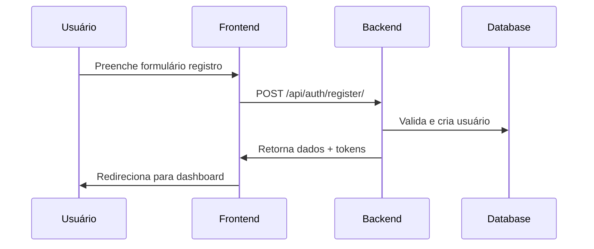

#### Código Frontend (Next.js)

```typescript
// services/auth.ts
async function register(data: RegisterData) {
  const response = await fetch('/api/auth/register/', {
    method: 'POST',
    headers: {
      'Content-Type': 'application/json',
    },
    body: JSON.stringify(data)
  });

  if (!response.ok) {
    throw new Error('Erro no registro');
  }

  const result = await response.json();
  saveTokens(result.tokens);
  return result.user;
}
```

#### Código Backend (Django)

```python
# views.py
class RegisterView(APIView):
    def post(self, request):
        serializer = UserRegisterSerializer(data=request.data)
        if serializer.is_valid():
            user = serializer.save()
            tokens = get_tokens_for_user(user)
            return Response({
                'user': UserSerializer(user).data,
                'tokens': tokens
            })
        return Response(serializer.errors, status=400)
```

### 2.2. Login

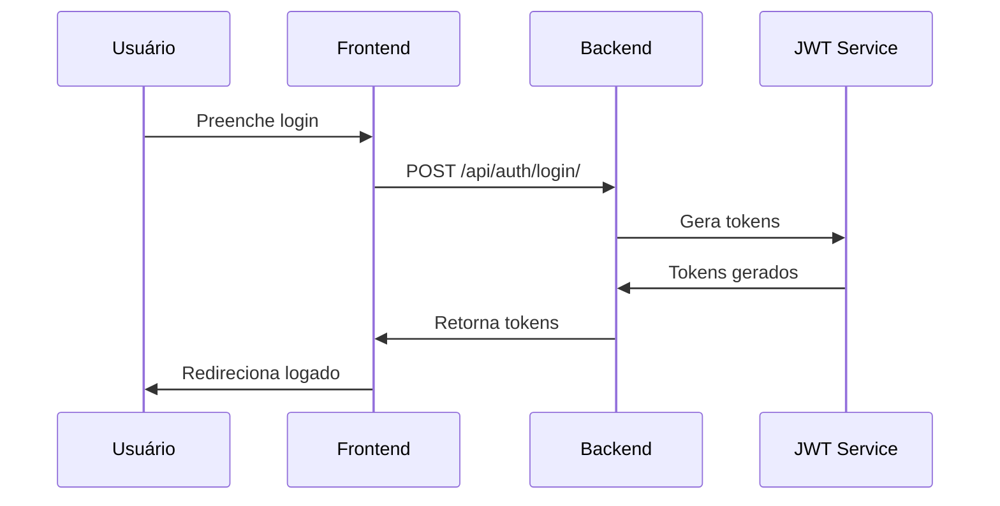

#### Implementação Frontend

```typescript
// hooks/useAuth.ts
export function useAuth() {
  const login = async (email: string, password: string) => {
    const response = await fetch('/api/auth/login/', {
      method: 'POST',
      headers: {
        'Content-Type': 'application/json',
      },
      body: JSON.stringify({ email, password })
    });

    const data = await response.json();
    if (response.ok) {
      setTokens(data.tokens);
      setUser(data.user);
    } else {
      throw new Error(data.message);
    }
  };

  return { login };
}
```

### 2.3. Refresh Token

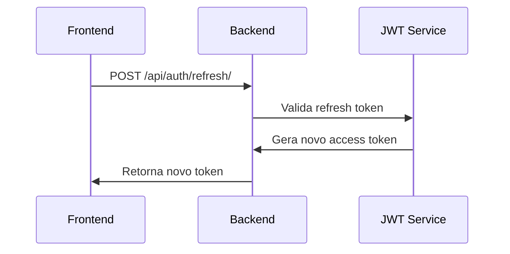

#### Implementação do Interceptor

```typescript
// utils/axios.ts
import axios from 'axios';

const api = axios.create();

api.interceptors.response.use(
  (response) => response,
  async (error) => {
    if (error.response?.status === 401) {
      const refresh = getRefreshToken();
      try {
        const { data } = await axios.post('/api/auth/refresh/', { refresh });
        setAccessToken(data.access);
        error.config.headers['Authorization'] = `Bearer ${data.access}`;
        return axios(error.config);
      } catch (err) {
        logout();
        return Promise.reject(error);
      }
    }
    return Promise.reject(error);
  }
);
```

---

## 3. Fluxos de Documentos

### 3.1. Geração de Documento

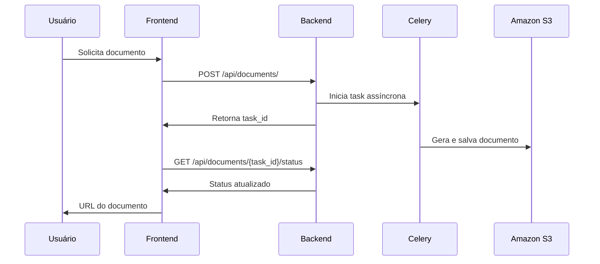

#### Frontend: Monitoramento de Progresso

```typescript
// hooks/useDocument.ts
function useDocumentGeneration() {
  const [progress, setProgress] = useState(0);
  const [status, setStatus] = useState('pending');

  const generateDocument = async (data: DocumentData) => {
    // Inicia geração
    const { task_id } = await api.post('/api/documents/', data);
    
    // Poll para status
    const interval = setInterval(async () => {
      const status = await api.get(`/api/documents/${task_id}/status`);
      setProgress(status.progress);
      
      if (status.state === 'completed') {
        clearInterval(interval);
        return status.download_url;
      }
    }, 2000);
  };

  return { generateDocument, progress, status };
}
```

### 3.2. Download de Documento

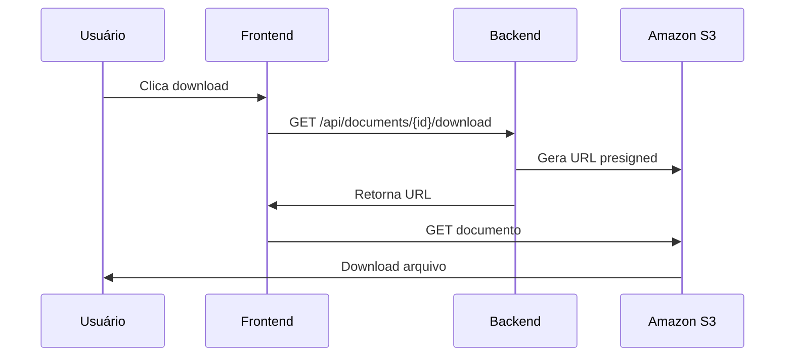

---

## 4. Fluxos de Pagamentos

### 4.1. Checkout

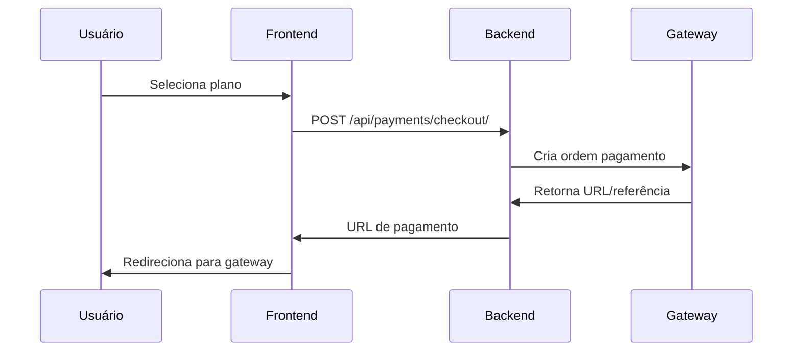

#### Implementação Checkout

```typescript
// services/payment.ts
async function initiateCheckout(planId: string) {
  const { data } = await api.post('/api/payments/checkout/', {
    plan_id: planId
  });

  // Redireciona para gateway
  if (data.redirect_url) {
    window.location.href = data.redirect_url;
  }

  return data;
}
```

### 4.2. Webhook de Pagamento

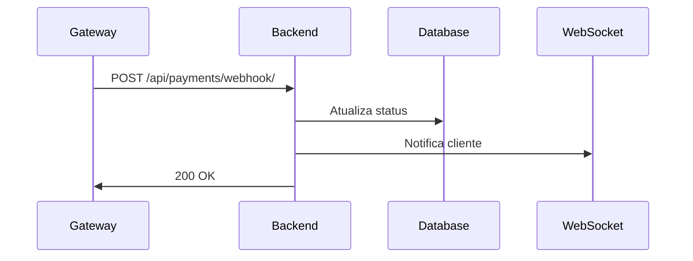

#### Backend: Processamento de Webhook

```python
# views.py
class PaymentWebhookView(APIView):
    permission_classes = []  # Público

    def post(self, request):
        # Valida assinatura
        signature = request.headers.get('X-Gateway-Signature')
        if not verify_signature(request.data, signature):
            return Response(status=400)

        # Processa pagamento
        payment_id = request.data['payment_id']
        status = request.data['status']

        try:
            payment = Payment.objects.get(gateway_id=payment_id)
            payment.status = status
            payment.save()

            # Notifica via WebSocket
            notify_payment_status(payment)

            return Response(status=200)
        except Payment.DoesNotExist:
            return Response(status=404)
```

---

## 5. Fluxos de Usuário

### 5.1. Atualização de Perfil

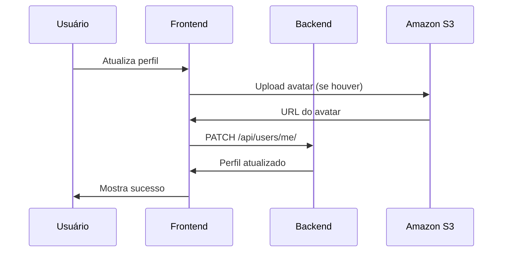

### 5.2. Recuperação de Senha

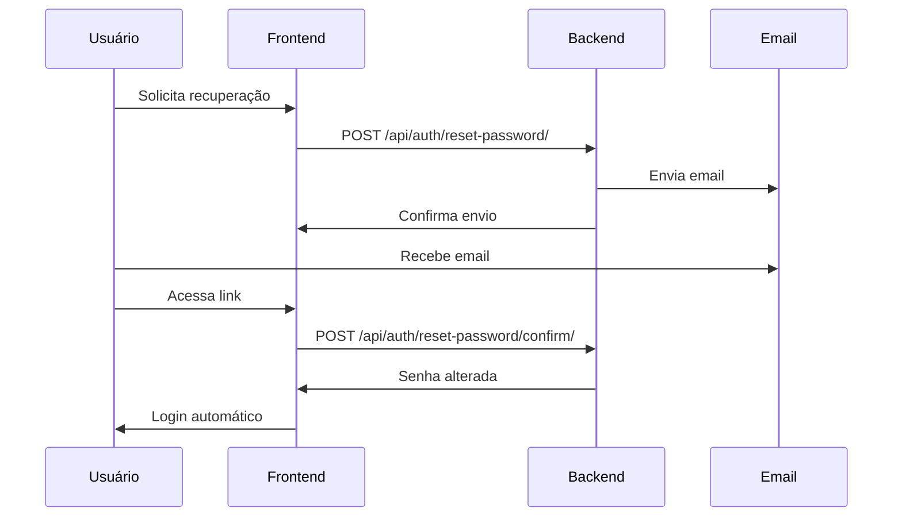

---

## 6. Fluxos de Upload/Download

### 6.1. Upload Direto para S3

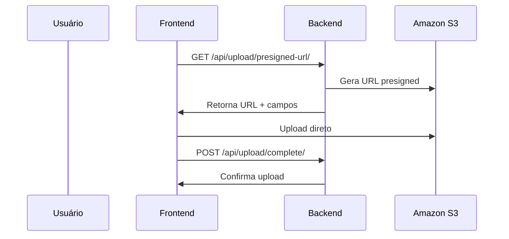

#### Implementação Frontend

```typescript
// hooks/useUpload.ts
function useS3Upload() {
  const upload = async (file: File) => {
    // 1. Obter URL presigned
    const { url, fields } = await api.get('/api/upload/presigned-url/', {
      params: { filename: file.name, type: file.type }
    });

    // 2. Formar FormData
    const formData = new FormData();
    Object.entries(fields).forEach(([key, value]) => {
      formData.append(key, value as string);
    });
    formData.append('file', file);

    // 3. Upload direto para S3
    await fetch(url, {
      method: 'POST',
      body: formData
    });

    // 4. Confirmar upload
    return api.post('/api/upload/complete/', {
      key: fields.key
    });
  };

  return { upload };
}
```

---

## 7. Fluxos de Erros e Exceções

### 7.1. Tratamento de Erros API

```typescript
// utils/api-error.ts
export class ApiError extends Error {
  constructor(
    public status: number,
    public message: string,
    public errors?: Record<string, string[]>
  ) {
    super(message);
  }
}

// utils/api.ts
api.interceptors.response.use(
  response => response,
  error => {
    if (error.response) {
      throw new ApiError(
        error.response.status,
        error.response.data.message,
        error.response.data.errors
      );
    }
    throw error;
  }
);
```

### 7.2. Retry Logic

```typescript
// utils/retry.ts
async function withRetry<T>(
  fn: () => Promise<T>,
  retries = 3,
  delay = 1000
): Promise<T> {
  try {
    return await fn();
  } catch (error) {
    if (retries === 0) throw error;
    await new Promise(resolve => setTimeout(resolve, delay));
    return withRetry(fn, retries - 1, delay * 2);
  }
}
```

---

## 8. Fluxos Assíncronos

### 8.1. Processamento em Background

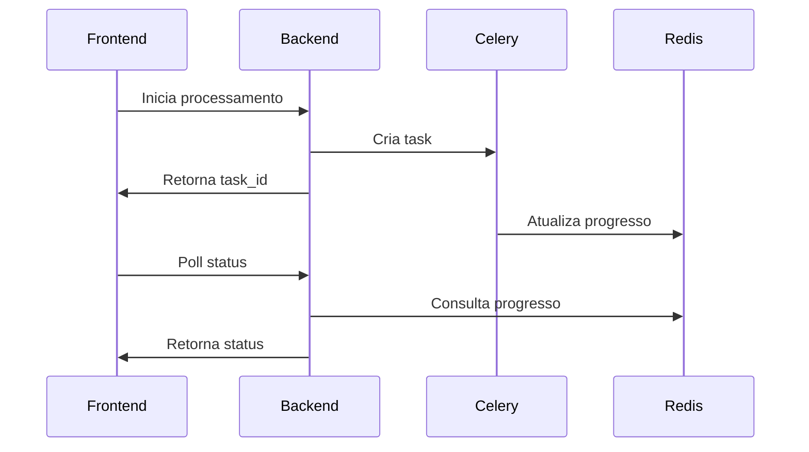

### 8.2. Notificações em Tempo Real

```typescript
// hooks/useNotifications.ts
function useNotifications() {
  useEffect(() => {
    const ws = new WebSocket(WS_URL);
    
    ws.onmessage = (event) => {
      const data = JSON.parse(event.data);
      switch (data.type) {
        case 'document_ready':
          notify(`Documento ${data.document_id} pronto!`);
          break;
        case 'payment_confirmed':
          notify('Pagamento confirmado!');
          break;
      }
    };

    return () => ws.close();
  }, []);
}
```

---

## 9. WebSockets

### 9.1. Configuração

```python
# routing.py
from channels.routing import ProtocolTypeRouter, URLRouter
from django.urls import path
from . import consumers

websocket_urlpatterns = [
    path('ws/notifications/', consumers.NotificationConsumer.as_asgi()),
    path('ws/documents/', consumers.DocumentConsumer.as_asgi()),
]

application = ProtocolTypeRouter({
    'websocket': URLRouter(websocket_urlpatterns),
})
```

### 9.2. Implementação Frontend

```typescript
// hooks/useWebSocket.ts
function useWebSocket(url: string) {
  const [socket, setSocket] = useState<WebSocket | null>(null);

  useEffect(() => {
    const ws = new WebSocket(url);
    
    ws.onopen = () => {
      console.log('Connected to WebSocket');
      setSocket(ws);
    };

    ws.onclose = () => {
      console.log('Disconnected from WebSocket');
      setTimeout(() => {
        // Reconecta após 5s
        setSocket(new WebSocket(url));
      }, 5000);
    };

    return () => ws.close();
  }, [url]);

  const send = useCallback((data: any) => {
    if (socket?.readyState === WebSocket.OPEN) {
      socket.send(JSON.stringify(data));
    }
  }, [socket]);

  return { socket, send };
}
```

---

## 10. Casos Especiais

### 10.1. Rate Limiting

```python
# decorators.py
from django_ratelimit.decorators import ratelimit

@ratelimit(key='ip', rate='5/m', method=['POST'])
@ratelimit(key='user', rate='100/d')
def protected_view(request):
    return Response(...)
```

### 10.2. Cache

```python
# views.py
from django.core.cache import cache

class DocumentViewSet(viewsets.ModelViewSet):
    @method_decorator(cache_page(60 * 15))  # 15 minutos
    def list(self, request):
        queryset = self.get_queryset()
        serializer = self.get_serializer(queryset, many=True)
        return Response(serializer.data)
```

### 10.3. Bulk Operations

```typescript
// services/documents.ts
async function bulkDownload(documentIds: number[]) {
  const response = await api.post('/api/documents/bulk-download/', {
    ids: documentIds
  });

  // Baixa zip com todos documentos
  window.location.href = response.data.download_url;
}
```

---

## Apêndice A: Códigos de Status HTTP

| Código | Significado | Uso |
|--------|-------------|-----|
| 200 | OK | Requisição bem sucedida |
| 201 | Created | Recurso criado com sucesso |
| 204 | No Content | Operação sucesso, sem retorno |
| 400 | Bad Request | Erro de validação |
| 401 | Unauthorized | Token inválido/expirado |
| 403 | Forbidden | Sem permissão |
| 404 | Not Found | Recurso não encontrado |
| 429 | Too Many Requests | Rate limit excedido |
| 500 | Internal Server Error | Erro no servidor |

## Apêndice B: Headers Comuns

```plaintext
Authorization: Bearer <token>
Content-Type: application/json
Accept: application/json
X-Request-ID: <uuid>
X-Client-Version: 1.0.0
```

## Apêndice C: Exemplos de Payloads

### Criação de Documento

```json
// Request
POST /api/documents/
{
  "title": "Contrato",
  "template_id": 123,
  "data": {
    "client_name": "João Silva",
    "value": 1000.00,
    "date": "2025-09-23"
  }
}

// Response
{
  "id": 456,
  "status": "processing",
  "task_id": "task-789",
  "estimated_time": 30
}
```

### Confirmação de Pagamento

```json
// Webhook
POST /api/payments/webhook/
{
  "event": "payment.confirmed",
  "data": {
    "payment_id": "pay_123",
    "status": "completed",
    "amount": 1000.00,
    "currency": "AOA",
    "timestamp": "2025-09-23T10:00:00Z"
  },
  "signature": "sha256=..."
}
```

---

Este documento detalha todos os fluxos de integração entre frontend e backend do SaberAngola, servindo como referência para desenvolvedores de ambas as equipes.