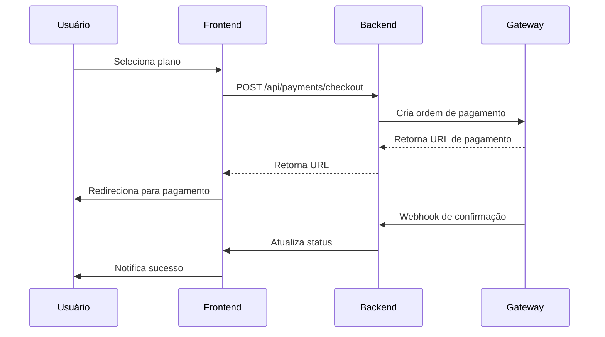

# Integração de Pagamentos - SaberAngola

Este documento detalha a integração completa do sistema de pagamentos da plataforma SaberAngola, incluindo gateways suportados, fluxos de pagamento, implementação e boas práticas.

## Sumário

1. [Visão Geral](#1-visão-geral)
2. [Gateways de Pagamento](#2-gateways-de-pagamento)
3. [Modelos de Dados](#3-modelos-de-dados)
4. [Fluxos de Pagamento](#4-fluxos-de-pagamento)
5. [Implementação Backend](#5-implementação-backend)
6. [Implementação Frontend](#6-implementação-frontend)
7. [Webhooks e Callbacks](#7-webhooks-e-callbacks)
8. [Segurança](#8-segurança)
9. [Testes e Validação](#9-testes-e-validação)
10. [Monitoramento e Logs](#10-monitoramento-e-logs)

## 1. Visão Geral

O sistema de pagamentos do SaberAngola integra múltiplos gateways de pagamento locais de Angola, permitindo diferentes métodos de pagamento para assinaturas e serviços.

### 1.1. Características Principais

- Múltiplos gateways de pagamento
- Gestão de assinaturas
- Histórico de transações
- Notificações automáticas
- Relatórios financeiros
- Sistema de retry para falhas
- Logs detalhados de transações

## 2. Gateways de Pagamento

### 2.1. EMIS (Multicaixa Express)

```python
# settings.py
EMIS_CONFIG = {
    'API_KEY': 'seu_api_key',
    'MERCHANT_ID': 'seu_merchant_id',
    'ENDPOINT': 'https://api.emis.co.ao/v1',
    'WEBHOOK_SECRET': 'seu_webhook_secret'
}
```

### 2.2. Unitel Money

```python
UNITEL_MONEY_CONFIG = {
    'API_KEY': 'seu_api_key',
    'MERCHANT_ID': 'seu_merchant_id',
    'ENDPOINT': 'https://api.unitel.money/v1',
    'WEBHOOK_SECRET': 'seu_webhook_secret'
}
```

### 2.3. Africell Money

```python
AFRICELL_CONFIG = {
    'API_KEY': 'seu_api_key',
    'MERCHANT_ID': 'seu_merchant_id',
    'ENDPOINT': 'https://api.africell.ao/v1',
    'WEBHOOK_SECRET': 'seu_webhook_secret'
}
```

## 3. Modelos de Dados

### 3.1. Planos (Plan)

```python
# payments/models.py
class Plan(models.Model):
    TYPES = [
        ('free', 'Gratuito'),
        ('basic', 'Básico'),
        ('premium', 'Premium'),
        ('enterprise', 'Empresarial')
    ]
    
    name = models.CharField(max_length=100)
    type = models.CharField(max_length=20, choices=TYPES)
    price = models.DecimalField(max_digits=10, decimal_places=2)
    currency = models.CharField(max_length=3, default='AOA')
    interval = models.CharField(max_length=20, default='month')
    features = models.JSONField(default=dict)
    active = models.BooleanField(default=True)
```

### 3.2. Assinaturas (Subscription)

```python
class Subscription(models.Model):
    STATUS_CHOICES = [
        ('active', 'Ativa'),
        ('pending', 'Pendente'),
        ('cancelled', 'Cancelada'),
        ('expired', 'Expirada')
    ]
    
    user = models.ForeignKey('users.User', on_delete=models.CASCADE)
    plan = models.ForeignKey(Plan, on_delete=models.PROTECT)
    status = models.CharField(max_length=20, choices=STATUS_CHOICES)
    start_date = models.DateTimeField()
    end_date = models.DateTimeField()
    auto_renew = models.BooleanField(default=True)
```

### 3.3. Transações (Transaction)

```python
class Transaction(models.Model):
    STATUS_CHOICES = [
        ('pending', 'Pendente'),
        ('processing', 'Processando'),
        ('completed', 'Completada'),
        ('failed', 'Falha'),
        ('refunded', 'Reembolsada')
    ]
    
    subscription = models.ForeignKey(Subscription, on_delete=models.PROTECT)
    amount = models.DecimalField(max_digits=10, decimal_places=2)
    currency = models.CharField(max_length=3, default='AOA')
    payment_method = models.CharField(max_length=50)
    status = models.CharField(max_length=20, choices=STATUS_CHOICES)
    gateway_reference = models.CharField(max_length=100)
    created_at = models.DateTimeField(auto_now_add=True)
    updated_at = models.DateTimeField(auto_now=True)
```

## 4. Fluxos de Pagamento

### 4.1. Fluxo de Checkout

1. Usuário seleciona plano
2. Sistema cria transação pendente
3. Redireciona para gateway
4. Gateway processa pagamento
5. Webhook notifica backend
6. Sistema atualiza status
7. Notifica usuário



### 4.2. Renovação Automática

1. Sistema identifica assinaturas próximas do vencimento
2. Inicia processo de cobrança
3. Processa pagamento via gateway
4. Atualiza status da assinatura
5. Notifica usuário

## 5. Implementação Backend

### 5.1. Serviço de Pagamento

```python
# payments/services.py
class PaymentService:
    def __init__(self, payment_method):
        self.gateways = {
            'emis': EMISGateway(),
            'unitel': UnitelMoneyGateway(),
            'africell': AfricellGateway()
        }
        self.gateway = self.gateways[payment_method]
    
    def create_checkout(self, data):
        try:
            # Criar transação
            transaction = Transaction.objects.create(
                subscription=data['subscription'],
                amount=data['amount'],
                payment_method=data['payment_method']
            )
            
            # Iniciar pagamento no gateway
            payment_url = self.gateway.create_payment({
                'amount': data['amount'],
                'reference': transaction.id,
                'description': f'Assinatura {data["plan_name"]}'
            })
            
            return {
                'transaction_id': transaction.id,
                'payment_url': payment_url
            }
        except Exception as e:
            logging.error(f'Erro no checkout: {str(e)}')
            raise PaymentError('Falha ao processar pagamento')
```

### 5.2. Views e Endpoints

```python
# payments/views.py
class CheckoutView(APIView):
    permission_classes = [IsAuthenticated]
    
    def post(self, request):
        data = request.data
        service = PaymentService(data['payment_method'])
        
        try:
            result = service.create_checkout(data)
            return Response(result, status=201)
        except PaymentError as e:
            return Response({'error': str(e)}, status=400)

class WebhookView(APIView):
    def post(self, request):
        gateway = request.headers.get('X-Gateway')
        service = PaymentService(gateway)
        
        try:
            service.process_webhook(request.data)
            return Response({'status': 'ok'})
        except Exception as e:
            logging.error(f'Erro no webhook: {str(e)}')
            return Response({'error': str(e)}, status=400)
```

## 6. Implementação Frontend

### 6.1. Componente de Checkout

```typescript
// components/Checkout.tsx
import { useState } from 'react'
import { usePayment } from '@/hooks/usePayment'

export const Checkout = ({ plan }) => {
  const [loading, setLoading] = useState(false)
  const { initiatePayment } = usePayment()
  
  const handleCheckout = async () => {
    setLoading(true)
    try {
      const { payment_url } = await initiatePayment({
        plan_id: plan.id,
        payment_method: 'emis'
      })
      
      window.location.href = payment_url
    } catch (error) {
      console.error('Erro no checkout:', error)
      // Mostrar erro ao usuário
    }
    setLoading(false)
  }
  
  return (
    <div>
      <h2>{plan.name}</h2>
      <p>{plan.price} AOA</p>
      <button 
        onClick={handleCheckout}
        disabled={loading}
      >
        {loading ? 'Processando...' : 'Assinar Agora'}
      </button>
    </div>
  )
}
```

### 6.2. Hook de Pagamento

```typescript
// hooks/usePayment.ts
import axios from 'axios'

export const usePayment = () => {
  const initiatePayment = async (data) => {
    const response = await axios.post('/api/payments/checkout/', data)
    return response.data
  }
  
  const checkStatus = async (transactionId) => {
    const response = await axios.get(`/api/payments/${transactionId}/`)
    return response.data
  }
  
  return { initiatePayment, checkStatus }
}
```

## 7. Webhooks e Callbacks

### 7.1. Processamento de Webhooks

```python
# payments/webhooks.py
class WebhookProcessor:
    def __init__(self, gateway):
        self.gateway = gateway
    
    def validate_signature(self, payload, signature):
        # Validar assinatura do webhook
        pass
    
    def process(self, data):
        transaction = Transaction.objects.get(
            gateway_reference=data['reference']
        )
        
        if data['status'] == 'success':
            transaction.status = 'completed'
            self._activate_subscription(transaction)
        elif data['status'] == 'failed':
            transaction.status = 'failed'
            self._handle_failure(transaction)
        
        transaction.save()
```

### 7.2. Notificações

```python
# payments/notifications.py
class PaymentNotifier:
    def notify_success(self, transaction):
        # Enviar email de confirmação
        send_email(
            template='payment_success',
            context={'transaction': transaction},
            to=transaction.subscription.user.email
        )
        
        # Notificar via websocket
        notify_client(
            event='payment_success',
            data={'transaction_id': transaction.id}
        )
```

## 8. Segurança

### 8.1. Validação de Webhooks

- Verificação de assinaturas
- Validação de IPs
- Rate limiting
- Timeout adequado

### 8.2. Proteção de Dados

```python
# payments/security.py
class PaymentSecurity:
    def mask_card_number(self, number):
        return f"{'*' * 12}{number[-4:]}"
    
    def encrypt_sensitive_data(self, data):
        # Criptografar dados sensíveis
        pass
    
    def validate_amount(self, amount, expected):
        return abs(amount - expected) < 0.01
```

## 9. Testes e Validação

### 9.1. Testes Unitários

```python
# payments/tests.py
class PaymentTests(TestCase):
    def test_checkout_creation(self):
        data = {
            'plan_id': 1,
            'payment_method': 'emis'
        }
        
        response = self.client.post('/api/payments/checkout/', data)
        self.assertEqual(response.status_code, 201)
        self.assertIn('payment_url', response.data)
    
    def test_webhook_processing(self):
        # Testar processamento de webhook
        pass
```

### 9.2. Testes de Integração

```python
class GatewayIntegrationTests(TestCase):
    def test_emis_integration(self):
        gateway = EMISGateway()
        result = gateway.create_payment({
            'amount': 5000,
            'reference': 'test-123'
        })
        self.assertIsNotNone(result['payment_url'])
```

## 10. Monitoramento e Logs

### 10.1. Logging

```python
# payments/logging.py
import logging

logger = logging.getLogger('payments')

class PaymentLogger:
    def log_transaction(self, transaction):
        logger.info(
            'Nova transação: %s, Valor: %s, Status: %s',
            transaction.id,
            transaction.amount,
            transaction.status
        )
    
    def log_error(self, error, context):
        logger.error(
            'Erro de pagamento: %s, Contexto: %s',
            str(error),
            context
        )
```

### 10.2. Métricas

```python
# payments/metrics.py
from prometheus_client import Counter, Histogram

payment_attempts = Counter(
    'payment_attempts_total',
    'Total de tentativas de pagamento',
    ['method', 'status']
)

payment_duration = Histogram(
    'payment_duration_seconds',
    'Duração do processamento de pagamento',
    ['method']
)
```

## Conclusão

O sistema de pagamentos do SaberAngola é:

- **Robusto:** Suporte a múltiplos gateways
- **Seguro:** Implementação de melhores práticas de segurança
- **Escalável:** Arquitetura preparada para crescimento
- **Monitorável:** Logs e métricas detalhados
- **Testável:** Cobertura completa de testes
- **Mantível:** Código organizado e bem documentado

Para questões específicas sobre implementação ou integrações, consulte a documentação dos gateways ou entre em contato com a equipe de desenvolvimento.